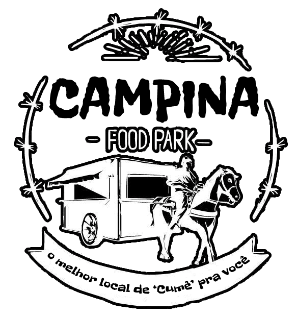

# API - Campina Food Park  🍽️🥤

[Logo adaptado da imagem*](https://bityli.com/hrGr07 )
## 📄 Descrição

  Campina Grande é uma cidade do interior da Paraíba conhecida nacionalmente como a cidade do "Maior São João do Mundo". CG atrai todos os anos pessoas de vários lugares por causa dos festejos juninos. Além de ser a capital do forró, Campina tem dentre seus pontos fortes a gastronomia, oferecendo vários pratos regionais feitos com ingredientes clássicos da culinária nordestina. Assim, a “CAMPINA FOOD PARK” tem como objetivo reunir os melhores estabelecimentos para você: conhecer, "cumê" e se deliciar com as iguarias típicas do Nordeste. 🤤

 Essa API foi desenvolvida como atividade do componente:  Projeto Guiado II do curso de Back-End ofertado pela {Reprograma} sob supervisão da professora Edlaine Pontes ❤️ e consiste na criação de uma aplicação para cadastrar estabelecimentos a fim de pôr em prática os conceitos aprendidos acerca da construção de uma API fundamentada no CRUD. 

---
## 🎯 Objetivos 

*  Cadastro de estabelecimentos que oferecem comida regional na cidade de Campina Grande-PB;

* Busca dos estabelecimentos cadastrados por id;

 * Avaliação dos estabelecimentos cadastrados através da opção de like e deslike feita pelos usuários;

 * Atualização e exclusão de estabelecimentos cadastrados.

---

## Arquitetura 

    Arquitetura MVC
    |
    \--📂  para_o_lar
        |   README.md
        |   .gitignore
        |   package-lock.json
        |   package.json
        |   server.js
        \--📂 node_modules
        \--📂 assets
        \--📂src
            |
            |       app.js
            |
            📂---controller
            |       
            |       estabelecimentoController.js
            |                      
            📂---models
            |              
            |       estabelecimento.json      
            |
            📂---routes
            |
            |      estabelecimentoRoutes.js 
            |       
            |__      

---
 ## 🛠Tecnologias
Para a construção do projeto, usamos as seguintes tecnologias:

- JavaScript

- Git/Github

- VsCode

- Node.js

- Nodemon

- Express

- Cors

- Postman

---

## ⚙️ Features

Funcionalidades da aplicação

* Cadastros do estabelecimento - POST;
* Like ou deslike - PATCH;
* Busca - GET;
* Busca por nome, bairro, categoria e delivery - GET
* Atualização em todos os campos - PUT
* Apagar - DELETE

---
## Instalação e Rotas

Para realizar a instação do projeto, siga esse passo a passo:

No terminal do Git Bash, clone o projeto

> git clone https://github.com/TaRosamistica/On14-TodasEmTech-s11-Revisao-API.git 

Entre na pasta do projeto:

> cd para_o_lar

Instale todas as dependências 

> npm install 

No terminal do Git Bash execute o servidor

> npm start 

 O servidor iniciará e exibirá a seguinte mensagem: 
 
 > Servidor rodando na porta: 7050

Utilize o **Postman**  para chamar e testar os endpoints da API localmente

Acesse: <http://localhost:7050>

---
Se precisar, fale comigo
- [linkedin](https://www.linkedin.com/in/talita-rosa-mistica-soares-de-oliveira-929436131/)
- [github](https://github.com/TaRosamistica)
- email: talita.rmsoareso@gmail.com
